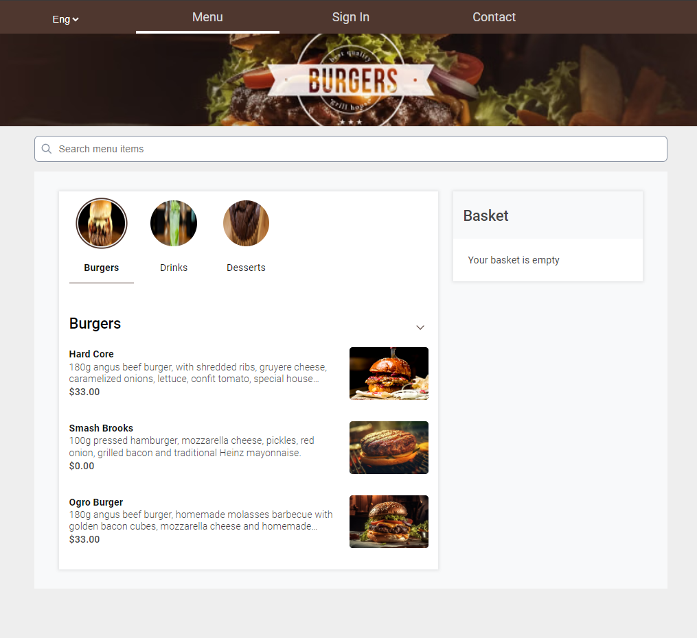
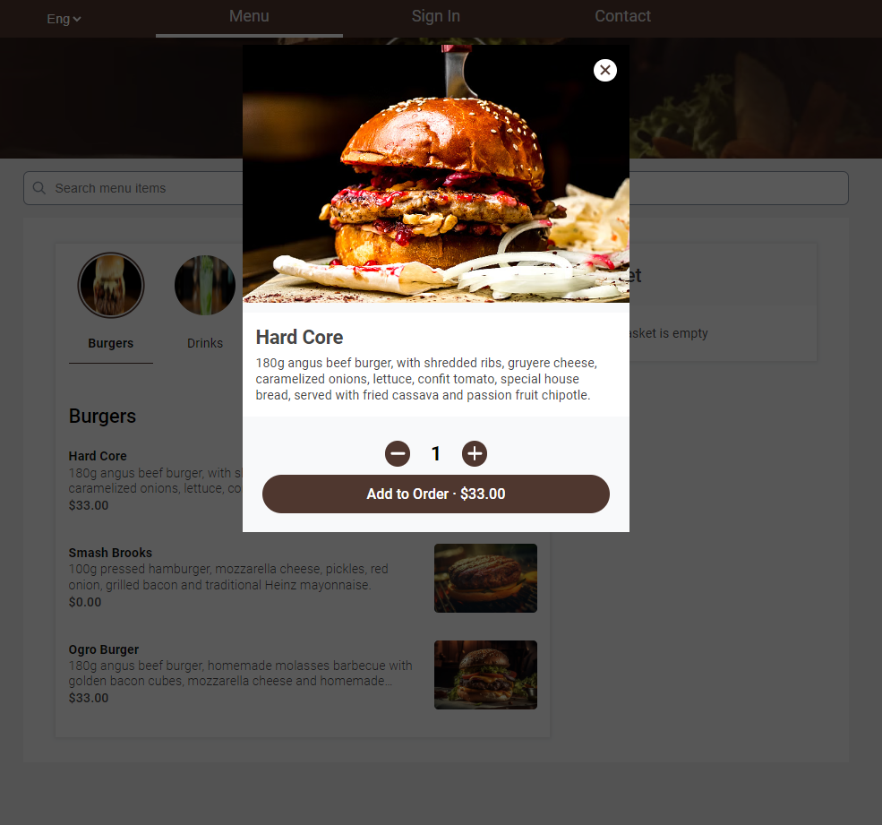
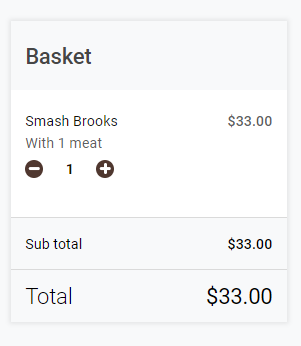
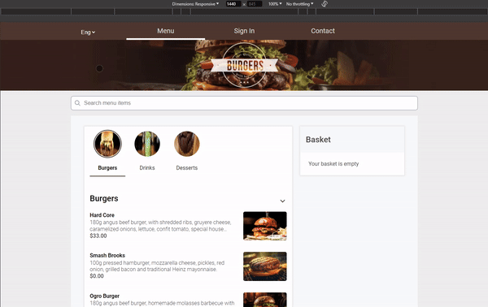
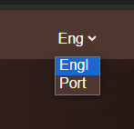
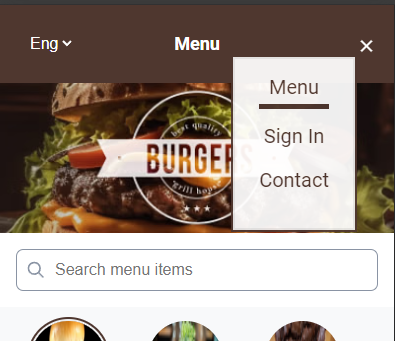

# Link to access the Application
https://food-app-test-kiyoshi.vercel.app/

# Restaurant Delivery

This is a restaurant food delivery application built with ReactJS.

## Overview

The application allows users to browse a menu of food items, add items to their cart, and view item details.

## Functionalities

- There's a feature to switch languages, it's located at the menu section on top left

- For mobile version, there's a expandable dropdown menu

## Screenshots
### Here are some images from the project

<table>
    <thead>
        <tr>
            <th>Menu Page</th>
            <th>Product Detail Modal</th>
            <th>Basket</th>
        </tr>
    </thead>
  <tr>
    <td>
      
    </td>
    <td>
      
    </td>
    <td>
      
    </td>
  </tr>
</table>

## Usage Demonstration

### Desktop



### Mobile


## Installation

To run the project locally, follow these steps:

1. Clone the repository:
    ```sh
    git clone https://github.com/Kiyoshi-san/food-app-test.git
    ```
2. Navigate to the project directory:
    ```sh
    cd food-app-test-kiyoshi
    ```
3. Install the dependencies:
    ```sh
    npm install
    ```

## Usage

To run the application in development mode, execute:
```sh
npm start
```
This will open the application at http://localhost:3000

## Available Scripts

- `npm start`: Runs the application in development mode.
- `npm test`: Runs the tests.
- `npm run build`: Builds the application for production.
- `npm run lint`: Lints the code.

## Project Structure

```sh
src/
├── assets/
├── components/
│   ├── ActiveSeciton/
│   ├── AlergyInformation/
│   ├── BottomCart/
│   ├── cart/
│   ├── HeroBanner/
│   ├── Menu/
│   ├── MenuSectionMenu/
│   ├── ProductInfo/
│   ├── Search/
│   ├── ui/
│   ├── Wrapper/
├── hooks/
│   ├── currency/
│   ├── restaurant/
│   ├── theme/
├── model/
│   ├── cart/
│   ├── menu/
│   ├── menuSection/
│   ├── restaurant/
│   ├── restaurantMenu/
├── pages/
│   ├── Menu/
│   ├── NotFoundPage/
│   ├── UnderConstruction/
├── redux/
│   ├── activeModal/
│   ├── cart/
│   ├── menuSection/
│   ├── navMenu/
├── utils/
│   ├── api/
│   ├── currency/
│   ├── i18n/
│   ├── testingTools/
├── index.css
├── index.tsx
├── react-app-env.d.ts
├── react-app-env.d.tsreposrtWebVitals.ts
├── setupTests.ts
```

## Technologies Used

- ReactJS
- Redux Toolkit
- React Router
- Typescript
- i18next
- Jest
- React Testing Library

## Decisions

I've created this app thinking on the best practices, to make it easier to understand and give it maintanability, here are some details: 
- The folder structures are organized which are divided by pages, components, utilities (util folder).

- Features that makes the development of the project more practical, such as: `Redux Tool Kit`, `React Hooks`.
    
- Lib to make the code convenient and secure as `TypeScript`.

- Libs to standard the code and to make it organized, like `Eslint` and `Prettier`.

### Application

Regarding to the application:
- I wanted to implement the Translation Switcher, which translates the common texts, which are not related to the products comming from API, like the texts from the Menu and Buttons.



- Also, for the mobile version put the dropdown menu to improve the user experience.

